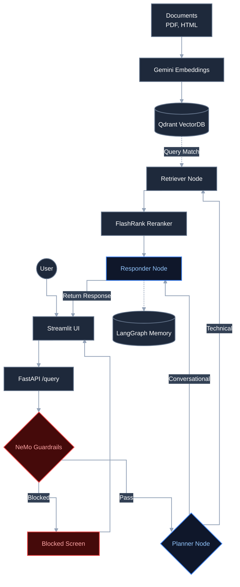

# Enterprise-technical-support-Agentic-RAG-chatbot
This RAG chatbot helps to answer typical technical questions from complex large pool of technical documents with noisy data. It dynamically decides whether to retrieve documents or answer from conversation history. Answers are grounded with citations. 

The chatbot also incorporates input guardrails, LangGraph-based orchestration, LLM Gateway integration, conversational memory, document citations, and retrieval reranking to provide reliable and traceable technical answers.

# Intelligent flow diagram
